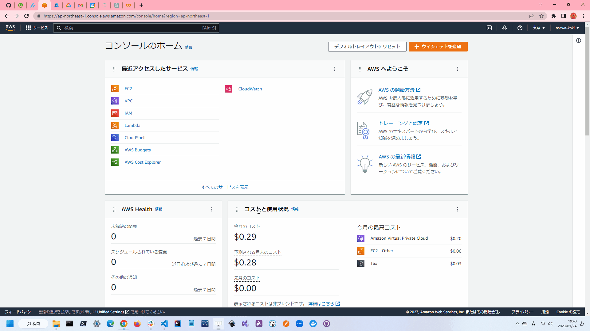

# simple-EC2.tf

TerraformでAWS上にEC2を立ち上げるサンプルです。  
基本的な構成要素は以下の通りです。  

* VPC
* Subnet
* Internet Gateway
* Route Table
* Security Group
* EC2

  

## 環境情報

| Name | Version |
| ---- | ---- |
| terraform | v1.3.7 |
| AWS CLI | 2.9.17 |

## 実行方法

`terraform.tfvars.example`をコピーして`terraform.tfvars`を作成し、適切な値を設定してください。  

```shell
terraform init
terraform plan
terraform apply
```

リソースを削除する場合は以下のコマンドを実行してください。  

```shell
terraform destroy
```

---

> **Warning**  
> AWSコンソール画面から直接削除しようとすると、リソースの削除し忘れが発生する可能性があるため、原則として`terraform destroy`を実行してください。  
> 特にElastic IPは、EC2インスタンスとは別に作成されるため、EC2インスタンスを削除してもElastic IPは削除されません。  
> Elastic IPを削除し忘れて高額な料金が発生してという事例も多くあるため、細心の注意を払ってください。  

## その他イロイロ

ファイアウォールルールは以下の通りです。  

* インバウンド通信はSSH(22)・HTTP(80)・HTTPS(443)のみ許可
* SSHは自分のIPアドレスのみ許可
* アウトバウンド通信は全て許可

## 各種設定

### Terraform

[公式サイト](https://developer.hashicorp.com/terraform/downloads)にそって、Terraformをダウンロードしてください。  
インストール後は、以下のコマンドを実行して、Terraformのバージョンを確認してください。  

```shell
terraform version
```

正しくインストールされていない場合には、パスが通っていない可能性があります。  
パスが通っていない場合は、以下のコマンドを実行して、パスを通してください。  

```shell
# Windows
$env:PATH += ";C:/★パス★"

# Unix系
export PATH=$PATH:/★パス★
```

### AWS CLI

[公式サイト](https://docs.aws.amazon.com/ja_jp/cli/latest/userguide/getting-started-install.html)にそって、AWS CLIをインストールしてください。  

インストール後は、以下のコマンドを実行して、AWSのアクセスキーとシークレットキーを設定してください。  

```shell
aws configure
```

必要な情報は以下の通りです。  

* AWS Access Key ID
* AWS Secret Access Key

AWSのアクセスキーとシークレットキーは、AWSのマネジメントコンソールから取得します。  
マネジメントコンソールにログインし、右上のアカウント名をクリックします。  
その後、マイセキュリティ資格情報をクリックします。  

左のメニューに表示されているユーザをクリックします。  
その後、対象のユーザを選択します。  
ユーザがない場合は、ユーザを作成します。  

ユーザを選択したら、アクセスキーを作成します。  
アクセスキーを作成すると、アクセスキーIDとシークレットアクセスキーが表示されます。  
アクセスキーIDとシークレットアクセスキーは、AWS CLIの設定に使用します。  
